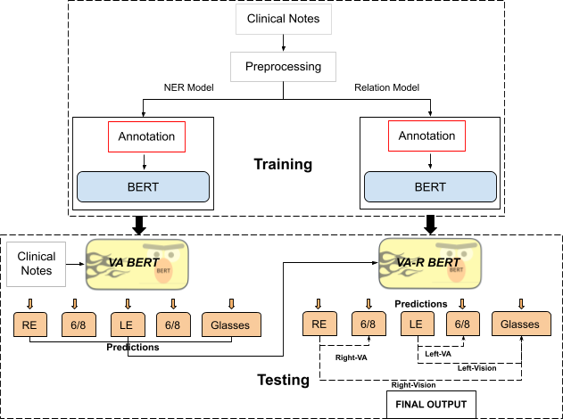

# VA BERT and VA-R BERT

This repository contains the code and pipelines to train named entity recognition and relation classification models for visual acuity in clinical letters.

<p align="center">
  
</p>

# Training VA BERT
```

## Training
Train with default config (defined in `config/train_config.json`)
```bash
python train.py
```

Override config's parameters by passing optional arguments
```
CUDA_VISIBLE_DEVICES=1 python train.py \
	--checkpoint 'models/name' \
	--max_epoch 150 
```
# Training VA-R BERT
```
## Training
USE -- jupyter notebook provided in notebook folder.
```

Other model/checkpoint can be from huggingface: `dmis-lab/biobert-v1.1`, `bert-base-cased`, etc.

Note: Check `config/train_config.json` before training

